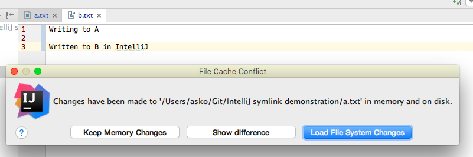

# IntelliJ symbolic link demonstration

Git supports symbolic links, and they are sometimes really, really, really cool to have a file turn up in two places in a repo, simultaneously. From Git's point of view, this simply works.

```
$ touch a.txt
$ ln -s a.txt b.txt
$ git add -A
```

Editing either `a.txt` or `b.txt` causes both to change.

## IntelliJ IDEA 15.0.2

Opening both the files `a.txt` and `b.txt` in IntelliJ at once causes a problem.

1. Open `a.txt` and write something (don't save)
2. Open `b.txt` and write something

You'll get this:



This is certainly understandable. IntelliJ IDEA treats the two files as separate, and nicely offers a way to see the diffs and merge the changes.

However, it can do better.

IntelliJ IDEA could notice that a file is actually a symbolic link, and follow that link. That would cause the same editor to be opened for both `a.txt` and `b.txt` files. This would certainly match my intention with the git layout, and would probably be the easiest way to handle the issue.

